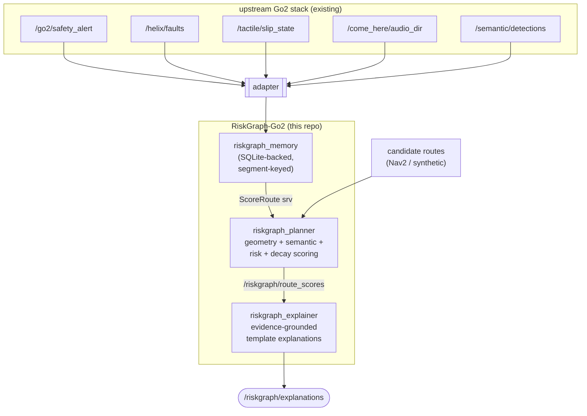

# RiskGraph-Go2

**Experience-grounded semantic navigation for a safer robotic guide dog.**

A ROS 2 Humble overlay that gives the Unitree Go2 a persistent, multi-modal memory of where it has previously experienced trouble — slip, safety alerts, audio anomalies, depth hazards, near-collisions — and uses that memory to bias route selection toward safer paths and emit human-readable justifications for why one route was chosen over another.

This repo is a sibling to (not a fork of) the existing Go2 stack: `GO2-seeing-eye-dog`, `go2-semantic-nav`, `helix`, `come-here`, `neuroskin`, `openvocab-tsdf`. It consumes their topics; it does not replace them.

---

## Problem

Plain semantic navigation answers *"where can I go that matches the user's intent?"* It does not answer *"where have I gotten in trouble before, and should I avoid it this time?"* Costmap layers in Nav2 capture instantaneous hazards but do not persist typed incident history across runs. Failure-aware locomotion (DreamFLEX, Ashfall, etc.) closes the loop at the controller level but does not push failures back into route selection. RiskGraph-Go2 fills that gap.

## Novelty (vs. plain semantic nav)

- A **persistent, multi-modal incident log** keyed to topological route segments — slip flags, safety-mode triggers, depth-hazard hits, audio anomalies, near-collision counters — survives across runs.
- **Cross-run route biasing**: candidate routes are scored using geometry cost + semantic objective + segment-conditioned risk penalty + recency decay + observation count.
- **Evidence-grounded explanations**: route choices cite the specific stored events that drove the decision. No free-form LLM rationalization required for the MVP.

The contribution is the integration. Each ingredient is prior art (see `docs/prior_art.md`); their combination, *Go2-targeted but currently hardware-unverified*, is, to our knowledge, not demonstrated end-to-end. No claim of "running on Go2" — see Validation status below.

## Architecture



Pure-Python core (`riskgraph_core`) holds the model logic and is testable without ROS; ROS nodes are thin adapters around it.

See `docs/architecture.md` for full detail.

## Quickstart

### Offline synthetic demo (no ROS hardware required)

```bash
git clone <this repo>
cd riskgraph-go2
./scripts/run_offline_demo.sh
```

This runs a deterministic scenario: two candidate routes between the same goal, one shorter but historically slip-prone, one longer but consistently safe. The planner should pick the longer route; the explainer should cite the specific slip events. Output is printed and written to `demo_results.json`.

### Run unit tests

```bash
./scripts/run_tests.sh
```

Runs `pytest` across all packages. Does not require ROS to be sourced for `riskgraph_core` tests; the ROS node tests skip themselves cleanly if `rclpy` is unavailable.

### Build with colcon (full ROS 2 Humble path)

```bash
source /opt/ros/humble/setup.bash
colcon build --symlink-install
source install/setup.bash
ros2 launch riskgraph_bringup demo_offline.launch.py
```

### Integrate with a live Go2 stack

```bash
ros2 launch riskgraph_bringup integration.launch.py \
    enable_safety_adapter:=true \
    enable_helix_adapter:=true \
    enable_tactile_adapter:=true
```

Adapters subscribe to upstream topics and forward into RiskGraph. See `docs/hardware_integration.md` for topic wiring and required upstream packages.

### Seed known route segments (phase 1)

`riskgraph_memory` accepts a `segment_seed_path` ROS parameter. When set,
it loads a JSON (or YAML) file describing the named route segments in the
operating environment, so that incoming `RiskEvent`s without a stamped
`segment_id` get spatially-joined to the nearest seed segment before
persistence. Without a seed, such events are stored unbound and the
planner cannot retrieve them by id.

A sample seed for the hw glossy-loop scenario is installed at
`share/riskgraph_bringup/config/segment_seeds/hw_glossy_loop.json`.
To use it from the integration launch, point `default.yaml` at the file:

```yaml
riskgraph_memory:
  ros__parameters:
    segment_seed_path: "/path/to/segment_seeds/hw_glossy_loop.json"
```

Schema (JSON):

```json
{
  "version": "1",
  "frame_id": "map",
  "segments": [
    {
      "segment_id": "hw_glossy",
      "start": [0.0, 0.0, 0.0],
      "end":   [4.0, 0.0, 0.0],
      "semantic_label": "hallway-glossy"
    }
  ]
}
```

Overlapping `segment_id` entries use last-write-wins; the node logs the
duplicates at WARN. A malformed seed file is loud (ERROR) but non-fatal:
the memory node starts with an empty `known_segments` list rather than
crashing the launch.

## Validation status

- **Verified offline:** core risk model unit tests, persistence round-trip, route-scoring regression (safer route is selected over shorter risky route), template explanation cites the dominant risk factor, deterministic synthetic demo.
- **Inferred runtime behavior:** ROS adapter wiring against upstream topic names — code is exercised in unit tests with mocked publishers; no live ROS bag run yet.
- **Hardware-dependent:** end-to-end behavior on Go2 + Jetson Orin NX with upstream stack live. Not yet performed. See `docs/validation.md` and `docs/hardware_integration.md`.

## Hardware proof boundary

This repo does **not** claim to run on a Go2 yet. The MVP target is software-validated — offline demo green, unit tests green, integration launch verified to start nodes without errors. Hardware proof requires a CaresLab session and is tracked separately.

## Layout

```
riskgraph-go2/
├── src/
│   ├── riskgraph_msgs/      # custom interfaces (ament_cmake)
│   ├── riskgraph_core/      # pure-Python risk model (no ROS dep)
│   ├── riskgraph_memory/    # SQLite-backed risk store ROS node
│   ├── riskgraph_planner/   # route scoring service
│   ├── riskgraph_explainer/ # evidence-grounded explanation node
│   ├── riskgraph_demo/      # synthetic publishers + orchestrator
│   └── riskgraph_bringup/   # launch + configs
├── docs/                    # architecture, prior art, demo, validation, audits
├── scripts/                 # demo + test entry points
└── AGENTS.md                # agent policy for this repo
```

## License

MIT. See `LICENSE`.
