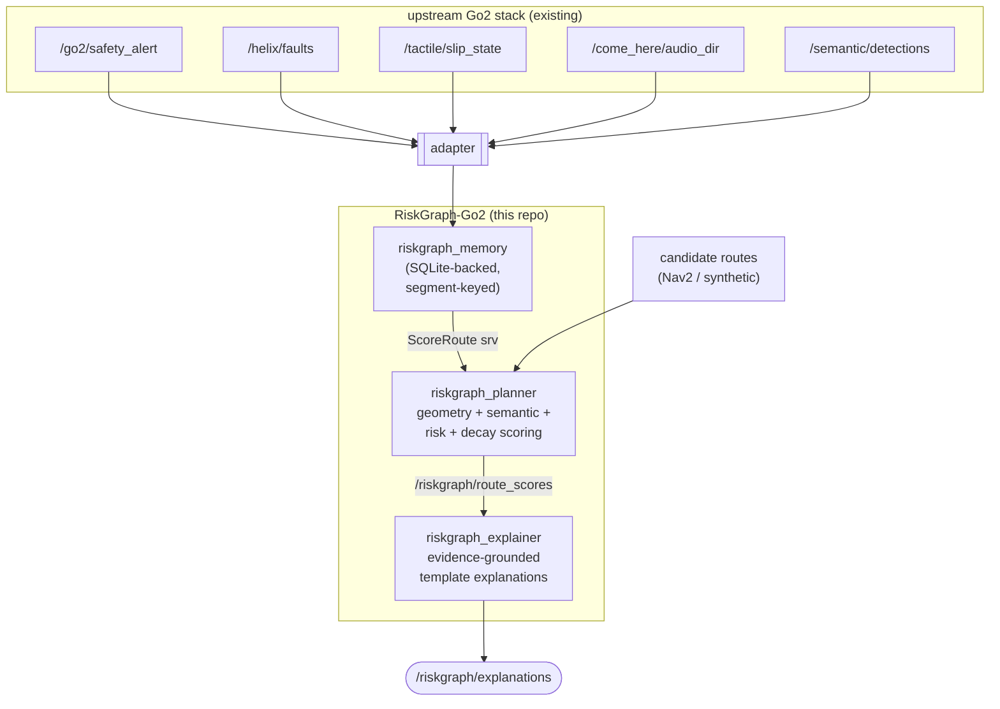

# RiskGraph-Go2

**A robot guide dog that remembers where it got into trouble, and routes around it next time.**

RiskGraph-Go2 is a ROS 2 Humble overlay for the Unitree Go2 that records every place the robot slipped, tripped a safety alert, or hit a depth hazard, keeps that log across runs, and uses it to pick safer routes while explaining in plain language why it made each choice.

## The problem

Semantic navigation answers "where can I go that matches the user's intent?" It does not answer "where have I gotten in trouble before, and should I avoid it this time?" Nav2 costmap layers capture instantaneous hazards, but they do not persist a typed incident history across runs, so a glossy patch of floor that made the robot slip yesterday costs nothing today. Failure-aware locomotion work closes the loop at the controller level, reacting to a slip as it happens, but never pushes that failure back into route selection. RiskGraph-Go2 is the missing piece in between: a persistent, segment-keyed incident memory that a route planner can query, with an audit trail attached to every decision.

## See it in 30 seconds

```bash
./scripts/run_offline_demo.sh
```

Deterministic scenario, no robot and no ROS install needed: two candidate routes to the same goal, one short but historically slip-prone, one longer but clean. Real output, written to [`demo_results.json`](demo_results.json):

| Route | Total cost | Geometry | Risk | Dominant segment | Dominant factor |
| --- | --- | --- | --- | --- | --- |
| SHORT | 14.523 | 4.000 | 10.523 | `glossy` | SLIP |
| LONG (chosen) | 7.405 | 7.405 | 0.000 | none | none |

The system does not just pick `LONG`, it says why, and cites the stored events that drove the decision:

> Chose route LONG because the alternative passed through glossy where 3 prior slips have been recorded. Going with the safer path.
>
> `evidence_event_ids: ["ev_slip_1", "ev_slip_2", "ev_safe_1"]`

That string is composed from templates in [`riskgraph_core/explainer.py`](src/riskgraph_core/riskgraph_core/explainer.py), not from an LLM, so every explanation is auditable against the persistent log. The cited ids are real rows in the SQLite store, and the offline demo asserts both the choice and the explanation on every run.

## Status: software-validated, hardware-UNVERIFIED

This repo has never been run on a real Go2. Everything below the "verified" line was demonstrated on a development workstation only.

| Area | Status | Evidence |
| --- | --- | --- |
| Core risk model: events, segments, store, scoring, explanations | Verified offline | 111 pytest tests pass (`./scripts/run_tests.sh`), including the headline regression that a safer-longer route beats a shorter-risky one |
| Cross-run memory (persistence, warm start, decay on restart) | Verified offline | SQLite round-trip tests over restart cycles in `test_cross_run_memory.py` |
| Offline end-to-end demo | Verified offline | `scripts/run_offline_demo.sh`, asserted choice and explanation, exits 0 |
| Live ROS pipeline, workstation only | Verified on a workstation, no robot | `scripts/ros_end_to_end_check.py` publishes synthetic events, calls the scoring service, checks the cited event ids (see `docs/validation.md`) |
| Adapters against real upstream messages | NOT verified | Unit-tested against injected message stubs only; live wire format and QoS untested |
| Anything on Go2 plus Jetson hardware: latency, frame_id agreement, spatial joins, tuned weights | NOT verified | Requires a lab session; test plan in `docs/hardware_integration.md` |

No claim of "running on Go2" is made anywhere in this repo. `docs/validation.md` is the single source of truth for what sits in which category.

## What is actually new here

- A **persistent, multi-modal incident log** keyed to topological route segments (slip flags, safety-mode triggers, depth-hazard hits, audio anomalies, near-collision counters) that survives across runs.
- **Cross-run route biasing**: candidate routes are scored on geometry cost plus semantic objective plus a segment-conditioned risk penalty, with recency decay and observation count.
- **Evidence-grounded explanations**: route choices cite the specific stored events that drove them. No free-form LLM rationalization in the MVP.

The contribution is the integration. Each ingredient is prior art (see `docs/prior_art.md`); the combination, Go2-targeted but currently hardware-unverified, is not one I have found demonstrated end-to-end.

This repo is a sibling to, not a fork of, the existing Go2 stack. It consumes upstream topics and does not replace any of those packages.

## Architecture


```mermaid
graph TD
    subgraph upstream["upstream Go2 stack (existing)"]
        T1["/go2/safety_alert"]
        T2["/helix/faults"]
        T3["/tactile/slip_state"]
        T4["/come_here/audio_dir"]
        T5["/semantic/detections"]
    end

    ADP[["adapter"]]

    subgraph riskgraph["RiskGraph-Go2 (this repo)"]
        MEM["riskgraph_memory<br/>(SQLite-backed,<br/>segment-keyed)"]
        PLN["riskgraph_planner<br/>geometry + semantic +<br/>risk + decay scoring"]
        EXP["riskgraph_explainer<br/>evidence-grounded<br/>template explanations"]
    end

    ROUTES["candidate routes<br/>(Nav2 / synthetic)"]
    OUT(["/riskgraph/explanations"])

    T1 --> ADP
    T2 --> ADP
    T3 --> ADP
    T4 --> ADP
    T5 --> ADP
    ADP --> MEM

    MEM -- "ScoreRoute srv" --> PLN
    ROUTES --> PLN
    PLN -- "/riskgraph/route_scores" --> EXP
    EXP --> OUT
```

The pure-Python core (`riskgraph_core`) holds the model logic and is testable without ROS; the ROS nodes are thin adapters around it. See `docs/architecture.md` for full detail.

| Package | Role |
| --- | --- |
| `riskgraph_msgs` | Custom interfaces (ament_cmake) |
| `riskgraph_core` | Pure-Python risk model, no ROS dependency |
| `riskgraph_memory` | SQLite-backed risk store node plus upstream adapters |
| `riskgraph_planner` | Route scoring service |
| `riskgraph_explainer` | Evidence-grounded explanation node |
| `riskgraph_demo` | Synthetic publishers and offline orchestrator |
| `riskgraph_bringup` | Launch files and configs |

## Quickstart

### Offline synthetic demo (no ROS, no hardware)

```bash
git clone https://github.com/yusufdxb/riskgraph-go2
cd riskgraph-go2
./scripts/run_offline_demo.sh
```

Output is printed and written to `demo_results.json` (the run shown above).

### Run the unit tests

```bash
./scripts/run_tests.sh
```

Runs `pytest` across the packages. ROS does not need to be sourced: `riskgraph_core` is pure Python, and the ROS node tests inject message stubs or skip cleanly when `rclpy` is unavailable.

### Build with colcon (full ROS 2 Humble path)

```bash
source /opt/ros/humble/setup.bash
colcon build --symlink-install
source install/setup.bash
ros2 launch riskgraph_bringup demo_offline.launch.py
```

### Integrate with a live Go2 stack

```bash
ros2 launch riskgraph_bringup integration.launch.py \
    enable_safety_adapter:=true \
    enable_helix_adapter:=true \
    enable_tactile_adapter:=true
```

Adapters subscribe to upstream topics and forward into RiskGraph. See `docs/hardware_integration.md` for topic wiring and required upstream packages. This path has not been exercised on a robot.

### Seed known route segments

`riskgraph_memory` accepts a `segment_seed_path` ROS parameter. When set, it loads a JSON (or YAML) file describing the named route segments in the operating environment, so that incoming `RiskEvent`s without a stamped `segment_id` get spatially joined to the nearest seed segment before persistence. Without a seed, such events are stored unbound and the planner cannot retrieve them by id.

A sample seed for the glossy-loop scenario is installed at `share/riskgraph_bringup/config/segment_seeds/hw_glossy_loop.json`. To use it from the integration launch, point `default.yaml` at the file:

```yaml
riskgraph_memory:
  ros__parameters:
    segment_seed_path: "/path/to/segment_seeds/hw_glossy_loop.json"
```

Schema (JSON):

```json
{
  "version": "1",
  "frame_id": "map",
  "segments": [
    {
      "segment_id": "hw_glossy",
      "start": [0.0, 0.0, 0.0],
      "end":   [4.0, 0.0, 0.0],
      "semantic_label": "hallway-glossy"
    }
  ]
}
```

Overlapping `segment_id` entries use last-write-wins, and the node logs the duplicates at WARN. A malformed seed file is loud (ERROR) but non-fatal: the memory node starts with an empty `known_segments` list rather than crashing the launch.

## Docs

| File | Contents |
| --- | --- |
| `docs/architecture.md` | Full component and data-flow detail |
| `docs/validation.md` | Per-claim validation status, the source of truth for what is proven |
| `docs/hardware_integration.md` | Topic wiring, upstream packages, hardware test plan |
| `docs/prior_art.md` | What is borrowed and from where |
| `docs/demo.md` | Offline demo walkthrough |

## License

MIT. See `LICENSE`.
