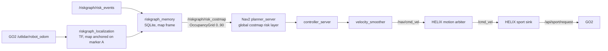

# RiskGraph-Go2

**A robot guide dog that remembers where it got into trouble, and routes around it next time.**

RiskGraph-Go2 is a ROS 2 Humble overlay for the Unitree Go2 that records every place the robot slipped, tripped a safety alert, or hit a depth hazard, keeps that log across runs, and uses it to pick safer routes while explaining in plain language why it made each choice.

## The problem

Semantic navigation answers "where can I go that matches the user's intent?" It does not answer "where have I gotten in trouble before, and should I avoid it this time?" Nav2 costmap layers capture instantaneous hazards, but they do not persist a typed incident history across runs, so a glossy patch of floor that made the robot slip yesterday costs nothing today. Failure-aware locomotion work closes the loop at the controller level, reacting to a slip as it happens, but never pushes that failure back into route selection. RiskGraph-Go2 is the missing piece in between: a persistent spatial incident memory that Nav2 plans with, with an audit trail attached to every decision.

## See it in 30 seconds

```bash
./scripts/run_offline_demo.sh
```

Deterministic scenario, no robot and no ROS install needed: two candidate routes to the same goal, one short but historically slip-prone, one longer but clean. Real output, written to [`demo_results.json`](demo_results.json):

| Route | Total cost | Geometry | Risk | Dominant segment | Dominant factor |
| --- | --- | --- | --- | --- | --- |
| SHORT | 14.523 | 4.000 | 10.523 | `glossy` | SLIP |
| LONG (chosen) | 7.405 | 7.405 | 0.000 | none | none |

The system does not just pick `LONG`, it says why, and cites the stored events that drove the decision:

> Chose route LONG because the alternative passed through glossy where 3 prior slips have been recorded. Going with the safer path.
>
> `evidence_event_ids: ["ev_slip_1", "ev_slip_2", "ev_safe_1"]`

That string is composed from templates in [`riskgraph_core/explainer.py`](src/riskgraph_core/riskgraph_core/explainer.py), not from an LLM, so every explanation is auditable against the persistent log. The cited ids are real rows in the SQLite store, and the offline demo asserts both the choice and the explanation on every run.

## Status: software validated, hardware experiment prepared, physical behavior UNVERIFIED

RiskGraph has never moved a real GO2. The live experiment is fully prepared
(`docs/HW_VERIFICATION.md`); everything below was demonstrated off-robot.

| Area | Status | Evidence |
| --- | --- | --- |
| Risk model, SQLite store v2, map identity, geometry, ingestion policy | Verified off-robot | `./scripts/run_tests.sh` (unit suites, no ROS needed) |
| Remembered risk changes Nav2's route | Verified off-robot, real Nav2 processes | `tests/integration`: one stored event moves NavFn from the left corridor to the right; SIGINT blanks the layer and the plan reverts; restart restores it from disk |
| TF: skewed-clock GO2 odometry to `map` via the start-marker anchor | Verified off-robot | `tests/integration` (fake odometry with the measured robot clock skew) |
| Full live procedure, Trials A-E, through the HELIX arbiter and sport sink | Rehearsed off-robot against a stand-in robot | `scripts/rehearse_live_trial.sh`; evidence is labelled REHEARSAL and can never count as hardware |
| GO2 physically walking the baseline and the risk-aware routes | **NOT verified** | Requires the lab session in `docs/HW_VERIFICATION.md` |
| Live upstream adapters (safety, HELIX faults, slip flag) | NOT verified | Stub-tested only; not needed by the canonical trial |

`docs/validation.md` is the single source of truth for what sits in which category.

## How it reaches the robot

RiskGraph is a planning / risk-memory layer. It never publishes a velocity or
a GO2 sport command.


```mermaid
flowchart LR
  ODOM["GO2 /utlidar/robot_odom"] --> LOC["riskgraph_localization<br/>TF, map anchored on marker A"]
  EV["/riskgraph/risk_events"] --> MEM["riskgraph_memory<br/>SQLite, map frame"]
  LOC --> MEM
  MEM -- "/riskgraph/risk_costmap<br/>OccupancyGrid 0..90" --> NAV["Nav2 planner_server<br/>global costmap risk layer"]
  NAV --> CTRL["controller_server"] --> VS["velocity_smoother"]
  VS -- "/nav/cmd_vel" --> ARB["HELIX motion arbiter"]
  ARB -- "/cmd_vel" --> SINK["HELIX sport sink"] -- "/api/sport/request" --> GO2["GO2"]
```

Risk is a non-lethal cost: when every corridor is risky, Nav2 still plans. The
only motion authority is the HELIX arbiter + sport sink; the live preflight
refuses to go if any other publisher of `/cmd_vel`, `/nav/cmd_vel` or
`/api/sport/request` appears.

| Package | Role |
| --- | --- |
| `riskgraph_msgs` | Interfaces (`RiskEvent` carries provenance and map id) |
| `riskgraph_core` | Pure-Python model: events, store, spatial risk field, map identity, experiment, scoring, explainer |
| `riskgraph_memory` | Memory node (TF, quarantine, SQLite, risk grid) and optional upstream adapters |
| `riskgraph_nav` | Anchored localization, live preflight, trial runner, evidence report, status and replay tools |
| `riskgraph_planner`, `riskgraph_explainer` | Segment-route scoring service and explanations |
| `riskgraph_demo` | Synthetic publisher and offline demo |
| `riskgraph_bringup` | Launch files, Nav2 config, the canonical course and map |

## Quickstart

```bash
./scripts/run_offline_demo.sh          # no ROS, no robot
./scripts/run_tests.sh                 # unit suites, no ROS

source /opt/ros/humble/setup.bash
colcon build --symlink-install && source install/setup.bash
python3 -m pytest tests/integration    # real RiskGraph + Nav2 processes, no robot
ros2 run riskgraph_nav riskgraph_status --db-tag trial   # DB path, schema, map id, incidents
```

Lab session (payload Jetson, after HELIX `HW_MOTION_TEST` stages D and E pass):

```bash
ros2 launch riskgraph_bringup riskgraph_nav_live.launch.py      # robot still on marker A
./scripts/preflight_live.sh --helix-session <helix_session_dir>  # must print PREFLIGHT: GO
./scripts/run_live_trial.sh --helix-session <helix_session_dir>  # Trials A-E, typed arming
```

Full procedure, abort conditions and PASS criteria: `docs/HW_VERIFICATION.md`.

## What is actually new here

- A **persistent, provenance-tagged incident log in the map frame** that survives restarts and refuses to attach itself to the wrong map.
- **Cross-run route biasing inside Nav2**: remembered risk becomes a planning cost layer, with measurable route changes and a restart ablation built into the experiment.
- **Evidence-grounded explanations** for scored routes, citing stored event ids.

Each ingredient is prior art (see `docs/prior_art.md`); the combination on a GO2 is not something I have found demonstrated end to end, and on the robot it is still to be demonstrated here.

## Docs

| File | Contents |
| --- | --- |
| `docs/HW_VERIFICATION.md` | Lab runbook: topology, launch order, trials, abort and PASS criteria, evidence |
| `docs/validation.md` | Per-claim validation status |
| `docs/architecture.md` | Components, persistence and risk models |
| `docs/hardware_integration.md` | Upstream adapter contracts and frame conventions |
| `docs/go2_field_notes.md` | Platform facts measured on the robot |
| `docs/prior_art.md`, `docs/demo.md` | Prior art; offline demo walkthrough |

## License

MIT. See `LICENSE`.
