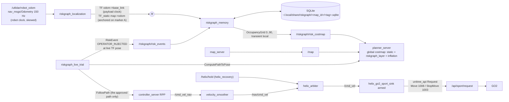

# RiskGraph-Go2: live GO2 trial runbook

This is the procedure for the first **moving** RiskGraph experiment on the
Unitree GO2. Follow it top to bottom in the lab. Nothing in it is verified on
the robot yet: status is **software validated / hardware experiment prepared /
physical hardware behavior unverified** until a run of this procedure passes
and its evidence bundle is reviewed.

The claim under test:

> Given the same start and goal, remembered risk on one feasible corridor
> makes Nav2 plan, and the GO2 walk, the other corridor; the memory survives
> a restart of RiskGraph.

## 1. What runs where

Everything runs **on the payload Jetson** (a workstation on the lab WiFi sees
none of the GO2 topics; `docs/go2_field_notes.md` section 9). A laptop only
opens SSH terminals.



| Interface | Type | Producer -> consumer |
|---|---|---|
| `/utlidar/robot_odom` | nav_msgs/Odometry, `odom`->`base_link` | GO2 -> riskgraph_localization, controller_server |
| `/tf` `odom`->`base_link` | tf2_msgs/TFMessage | riskgraph_localization (restamped on the payload clock) |
| `/tf_static` `map`->`odom` | tf2_msgs/TFMessage | riskgraph_localization (anchor) |
| `/riskgraph/localization/status` | std_msgs/String (JSON) | riskgraph_localization |
| `/riskgraph/risk_events` | riskgraph_msgs/RiskEvent | trial runner, adapters -> riskgraph_memory |
| `/riskgraph/risk_costmap` | nav_msgs/OccupancyGrid (0..90) | riskgraph_memory -> global_costmap `riskgraph_layer` |
| `/riskgraph/status` | std_msgs/String (JSON) | riskgraph_memory |
| `/compute_path_to_pose` | nav2_msgs/action/ComputePathToPose | runner -> planner_server |
| `/follow_path` | nav2_msgs/action/FollowPath | runner -> controller_server |
| `/cmd_vel_nav` -> `/nav/cmd_vel` | geometry_msgs/Twist | controller_server -> velocity_smoother -> helix_arbiter |
| `/cmd_vel` | geometry_msgs/Twist | helix_arbiter (sole publisher) -> helix_go2_sport_sink |
| `/api/sport/request` | unitree_api/msg/Request | helix_go2_sport_sink -> GO2 |

**RiskGraph never publishes a velocity or a sport command.** The only motion
authority is the HELIX arbiter + sport sink (HELIX repo,
`docs/MOTION_ARBITRATION.md`). The preflight fails if any RiskGraph process
publishes a Twist or a `unitree_api` Request, if `/cmd_vel` has any publisher
other than `helix_arbiter`, if `/nav/cmd_vel` has any publisher other than
`velocity_smoother`, or if `/api/sport/request` gains a publisher outside the
HELIX stage-A baseline. A static test in `riskgraph_nav/test` also fails the
build if RiskGraph source creates such a publisher.

### Why these design choices

* **Map frame = marker A.** A stock GO2 has no `map` frame and no `/tf`.
  `riskgraph_localization` solves `map->odom` once, with the robot standing
  still on marker A, so marker A is (0, 0, 0) in `map` every session.
  Localization is the robot's own lidar odometry from there on; drift over the
  ~6 m course is the limitation (section 10).
* **Risk is a planning cost, never an obstacle.** Grid values are capped at
  90 (Nav2 cost ~228, below inscribed 253), are not inflated, and are not in
  the local costmap. If every corridor is risky Nav2 still plans (Trial E).
* **Plan once, execute exactly that plan.** No bt_navigator, no recovery
  behaviors (spin / back-up would move the robot in ways nobody approved). The
  runner shows the route, the operator arms it, the controller follows it.
* **No in-place rotation, no reversing.** The sink rejects `|wz| > 0.5`, and
  the mcf gait does not step for in-place yaw below ~1.0 rad/s. The course
  starts and ends facing along the route; Nav2 limits are 0.20 m/s and
  0.40 rad/s, strictly inside the sink limits (0.25 / 0.50).
* **Lidar is not an obstacle source.** Its stamps are on the robot clock
  (months off) and its extrinsics were measured pose dependent. The course
  boundary and the box come from the map; the spotter and the remote cover
  everything else.

## 2. Before the session (at home, off-robot, mandatory)

The lab network has no internet (field notes section 7). Stage everything.

1. On the workstation, at the candidate SHA:
   ```bash
   cd ~/Projects/personal/riskgraph-go2 && git status --porcelain   # must be empty
   source /opt/ros/humble/setup.bash && colcon build --symlink-install
   ./scripts/run_tests.sh                                            # all pass
   source install/setup.bash && python3 -m pytest tests/integration  # all pass
   ./scripts/rehearse_live_trial.sh <helix_rehearsal_session>        # RESULT: COMPLETED, machine checks PASS
   ```
   (`<helix_rehearsal_session>` comes from HELIX `scripts/hw_rehearsal.sh <dir>`.)
2. Copy this repo at that SHA to the payload and build it there, next to the
   HELIX workspace and the unitree_ros2 workspace (`unitree_api`, `unitree_go`).
3. Confirm Nav2 is installed **on the payload** (it has never been checked there):
   ```bash
   for p in nav2_map_server nav2_planner nav2_navfn_planner nav2_controller \
            nav2_regulated_pure_pursuit_controller nav2_velocity_smoother \
            nav2_lifecycle_manager nav2_costmap_2d; do ros2 pkg prefix $p >/dev/null || echo MISSING $p; done
   ```
   If anything is missing, stage the arm64 `.deb`s before the session; the
   preflight (P08) will stop the trial otherwise.
4. If the room cannot fit the course (7.0 x 3.6 m), edit
   `src/riskgraph_bringup/config/experiment/two_corridor.yaml`, run
   `ros2 run riskgraph_nav riskgraph_generate_course_map`, rebuild, commit.
   A new geometry means a new map id and a new database.

## 3. Physical setup

Tape on the floor (map frame, metres; +x from A towards B, +y to the robot's left):

| Item | Where |
|---|---|
| Marker **A** (start) | (0, 0), robot faces +x |
| Marker **B** (goal) | (5, 0) |
| The box (obstacle) | x 2.0..3.0, y -0.65..+0.35 (1.0 x 1.0 m, centre (2.5, -0.15)) |
| Cleared area | x -1.0..6.0, y -1.8..+1.8; nothing else inside |
| Left corridor (baseline) | y +0.35..+1.8 beside the box |
| Right corridor (risk-aware) | y -1.8..-0.65 beside the box |

People: operator at the laptop, **spotter with the handheld remote** walking
beside the robot, both outside the corridors. The lab e-stop within reach.

## 4. Network and environment (every payload terminal)

```bash
ssh unitree@<payload>                      # then: tmux new -s rg
source /opt/ros/humble/setup.bash
source <UNITREE_WS>/install/setup.bash     # unitree_api, unitree_go
source <HELIX>/install/setup.bash
source ~/riskgraph-go2/install/setup.bash
export RMW_IMPLEMENTATION=rmw_cyclonedds_cpp
grep -o 'NetworkInterface name="[^"]*"' "${CYCLONEDDS_URI#file://}"   # must be enP8p1s0
ip -brief link show enP8p1s0                                           # must be UP
sudo date -s "<current UTC time>"          # payload has no RTC; evidence needs a real clock
ros2 daemon stop
ros2 topic hz /utlidar/robot_odom          # ~150 Hz, or STOP (topic presence is not data)
```

## 5. Launch order

**0. HELIX motion path first.** Run HELIX `docs/HW_MOTION_TEST.md` stages A-F
on this robot today (it creates the session dir with `sport_baseline.json` and
stage D/E evidence). RiskGraph's preflight refuses to go without stage D and E
PASS, non-rehearsal. Keep that session dir path: `$HSESSION`.

Terminals (all on the payload, environment from section 4):

```bash
# T1: HELIX closed loop + motion arbiter (recovery can only hold, never move)
ros2 launch helix_bringup helix_closedloop.launch.py auto_activate_recovery:=true recovery_enabled:=true

# T2: sport sink, ARMED (the only path from /cmd_vel to the robot)
ros2 run helix_arbiter helix_go2_sport_sink --ros-args -p mode:=armed
```
Expected: T1 shows the arbiter `NO_LIVE_INPUT`; T2 shows mode armed, StopMove at 2 Hz while idle.

Stand the robot **with the remote** (stand lock, then Start; never through the
API; only mcf). Walk it onto marker A facing B. Release the sticks.

```bash
# T3: anchored localization + Nav2 (robot must be STILL on marker A)
ros2 launch riskgraph_bringup riskgraph_nav_live.launch.py
```
Expected within ~5 s:
`ANCHORED epoch 1 on marker A: robot odom pose (...) -> map (0.0, 0.0, 0.0)` and
`Managed nodes are active`. If the robot was not on A: Ctrl-C, place it, relaunch.

```bash
# T4: preflight (RiskGraph NOT running yet; the runner launches it)
cd ~/riskgraph-go2
./scripts/preflight_live.sh --helix-session $HSESSION --expected-branch <branch>
```
Expected: a table of checks P01..P38 and `PREFLIGHT: GO`. Any FAIL prints
`PREFLIGHT: NO-GO ... DO NOT MOVE THE ROBOT` and the failing checks. Fix,
rerun. Do not continue on NO-GO.

```bash
# T4: the trial (Trials A-E), with evidence
./scripts/run_live_trial.sh --helix-session $HSESSION --expected-branch <branch> --db-tag $(date +%Y%m%d)
```

## 6. What the runner does, and what you do

| Step | Runner | You |
|---|---|---|
| start | writes `manifest.json`, copies the DB, preflight (before launch), launches RiskGraph, preflight again (running), starts the rosbag | type `REMOTE IN HAND` |
| Trial A | checks the robot is on A and still; asks Nav2 for a path to B; prints the **arming screen** (goal, pose, route, risk entries, arbiter, sink, Nav2 states, DB, SHA, map id) | check the route is the LEFT corridor; type `ARM LIVE GO2 RISKGRAPH TRIAL` |
| | sends that exact path to the controller and monitors (abort list, section 7) | spotter walks beside, remote ready |
| Trial B | takes the robot pose it recorded (TF, live) where the baseline passed the box, stores an `OPERATOR_INJECTED` event there, verifies the SQLite row and that Nav2's costmap rose | type `INJECT RISK` |
| Trial C | asks you to put the robot back on A | walk it back on A facing B with the remote, release sticks, Enter |
| | plans again; requires the route to change corridor and lower risk BEFORE it will arm; arming screen | type `ARM LIVE GO2 RISKGRAPH TRIAL`; watch it take the RIGHT corridor |
| Trial D | stops RiskGraph entirely; verifies the risk layer went blank and Nav2 plans LEFT again; relaunches RiskGraph from the same file; verifies a new process with the same incident count and that Nav2 plans RIGHT again | put the robot on A when asked; `y` to walk the D route (optional) |
| Trial E | stores a second event on the right corridor (from the pose recorded in C), plans 5 times from A: valid, identical, non-lethal; plans to a goal inside a risk region | nothing |
| end | stops the bag, copies the DB, stops RiskGraph, writes metrics, SVG, summary | one-line notes; type `OBSERVED` only if you saw the robot walk both routes with no stick input during navigation |

Ctrl-C at any time cancels the active Nav2 goal and verifies the command stops.

## 7. Abort conditions (the runner aborts automatically on the first six)

* localization invalid, stale, or odometry jump (latched until re-anchored)
* `map -> odom -> base_link` TF missing for > 0.5 s
* robot > 0.75 m off the approved route, or > 0.35 m/s
* another motion source appears (`/cmd_vel`, `/nav/cmd_vel`, `/api/sport/request` publishers change)
* HELIX hold active, arbiter status stale, RiskGraph unhealthy / invalid grid / map id mismatch
* no progress (< 0.2 m in 15 s: oscillation or stall), or > 120 s
* **operator:** the GO2 moves unexpectedly, the command persists after cancel
  (the runner shouts `USE THE HANDHELD REMOTE`), the route shown is obviously
  malformed, or the spotter loses a reliable stop. Use the remote / e-stop
  first, Ctrl-C second. Never "push through".

## 8. PASS criteria (all required)

Machine-checked in `summary.json` (`criteria`):

1. live localization fed the system (preflight GO)
2. baseline A->B executed to success
3. risk event stored at the captured live map pose (error < 1e-6 m)
4. event present in the intended SQLite database
5. route risk cost lower for the risk-aware plan under the same field
6. Nav2 global costmap raised at the event
7. a physically different (other corridor), lower-risk route planned
8. the GO2 executed that corridor (odometry), with lower executed risk
9. restart kept the event (new process, same incidents, same DB)
10. restored risk changes the route again (and the ablation reverts it)
11. no second motor authority; 12. motion only through arbiter + sink
13. evidence bundle complete; E. graceful fallback

`hardware_pass` in `summary.json` is true only if the evidence class is
`hardware` (live mode), every criterion passed **and** the operator typed
`OBSERVED`. Rehearsal and replay can never set it. Nothing updates the
README automatically; a human does that after reviewing the bundle.

## 9. Evidence locations

`~/riskgraph_runs/<YYYYmmdd_HHMMSS>_<sha7>/`:

| File | Contents |
|---|---|
| `manifest.json` | evidence class, git SHA/branch/dirty, host, env (distro, domain, RMW, Cyclone URI), args, map id, DB path |
| `git_diff.patch` | `git diff HEAD` at start (must be empty for hardware) |
| `preflight_before_launch.json`, `preflight.json` | every check, verdict, and the raw facts (graph, rates, params) |
| `config/` | experiment file, map `.yaml` + `.pgm`, `nav2_live.yaml` |
| `db/riskgraph_before.sqlite`, `db/riskgraph_after.sqlite` | consistent copies of the trial database |
| `trials/*.json` | plans (all poses), executions (10 Hz pose samples), injections (stored row), D and E records |
| `routes_comparison.json`, `routes.svg` | baseline vs risk-aware, planned and executed |
| `summary.json`, `summary.md` | criteria, `machine_pass`, `hardware_pass` |
| `bag/` | rosbag2 of `config/rosbag/live_trial_topics.txt` |
| `graph/` | node/topic/endpoint snapshots and parameter dumps, start and end |
| `logs/` | runner log, RiskGraph launch logs, bag log |
| `operator_notes.txt` | notes and attestation |

The database itself: `~/.local/share/riskgraph/<map_id>/<db_tag>.sqlite`.
Inspect any time (read-only, never creates a file):
`ros2 run riskgraph_nav riskgraph_status --db-tag <tag> [--live]`.

Replay parity afterwards (off-robot): `./scripts/replay_trial_bag.sh <run_dir>`.

## 10. Troubleshooting

| Symptom | Check |
|---|---|
| P14 odometry 0 Hz but topic listed | Cyclone interface (section 4), `ros2 daemon stop` |
| P17 UNANCHORED | robot was moving at launch: stay still on A, or `ros2 service call /riskgraph/localization/anchor std_srvs/srv/Trigger` |
| P17 JUMP | odometry jumped (robot rebooted or odom reset): put the robot on A, call the anchor service |
| P20 extra TF publisher | another stack publishes `/tf` (e.g. an odom broadcaster): stop it |
| P27 / P28 map or class mismatch | the DB belongs to another course or a rehearsal: use a new `--db-tag` |
| P33 no baseline / extra publisher | pass the HELIX session dir; stop the extra `/api/sport/request` publisher |
| P35 HELIX holding | HELIX saw a fault: check T1, wait for release; a trial under a hold is confounded |
| P37 FAIL | HELIX stages D/E have not passed on this robot today |
| Trial C refuses to arm | the plan did not change corridor: check `ros2 topic echo --once /riskgraph/status`, and that `/global_costmap/costmap` is high at the event |
| robot does not move after arming | sink not armed, arbiter holding, or the gait does not respond to 0.2 m/s (section 11) |

Useful: `ros2 topic echo --once /riskgraph/localization/status`,
`ros2 topic echo --once /riskgraph/status`, `ros2 run tf2_ros tf2_echo map base_link`,
`ros2 topic echo /helix/arbiter/status --field reason`.

## 11. Known limitations and hardware-only unknowns

* **Gait at Nav2 speeds.** Nav2 commands <= 0.20 m/s with gentle yaw while
  walking. The GO2 moved at 0.15 m/s in HELIX stage D; whether mcf tracks
  combined forward + yaw well enough to follow the curve round the box is
  unmeasured (the gait notes say combined commands degrade).
* **Odometry drift** over ~12 m of walking per trial, and after walking the
  robot back by hand: the runner requires the robot within 0.30 m / 20 deg of
  A before each trial, so drift shows up as a refused start, not as bad data.
* **Physical stop latency and distance** through the HELIX chain are HELIX's
  stage-E measurements, not RiskGraph's.
* **Nav2 on the payload** is not yet confirmed installed (section 2).
* The lidar is not used for obstacles in this trial (section 1).
