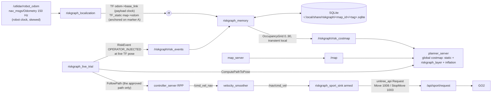

# RiskGraph-Go2: live GO2 trial runbook

This is the procedure for the first **moving** RiskGraph experiment on the
Unitree GO2. Follow it top to bottom in the lab. The stack has been brought up
on the payload with the robot lying still (section 12); nothing that moves the
robot is verified yet: status is **software validated / stack verified on the
payload at rest / physical hardware behavior unverified** until a run of this
procedure passes and its evidence bundle is reviewed.

The claim under test:

> Given the same start and goal, remembered risk on one feasible corridor
> makes Nav2 plan, and the GO2 walk, the other corridor; the memory survives
> a restart of RiskGraph.

## 1. What runs where

Everything runs **on the payload Jetson** (a workstation on the lab WiFi sees
none of the GO2 topics; `docs/go2_field_notes.md` section 9). A laptop only
opens SSH terminals.



| Interface | Type | Producer -> consumer |
|---|---|---|
| `/utlidar/robot_odom` | nav_msgs/Odometry, `odom`->`base_link` | GO2 -> riskgraph_localization, controller_server |
| `/tf` `odom`->`base_link` | tf2_msgs/TFMessage | riskgraph_localization (restamped on the payload clock) |
| `/tf_static` `map`->`odom` | tf2_msgs/TFMessage | riskgraph_localization (anchor) |
| `/riskgraph/localization/status` | std_msgs/String (JSON) | riskgraph_localization |
| `/riskgraph/risk_events` | riskgraph_msgs/RiskEvent | trial runner, adapters -> riskgraph_memory |
| `/riskgraph/risk_costmap` | nav_msgs/OccupancyGrid (0..90) | riskgraph_memory -> global_costmap `riskgraph_layer` |
| `/riskgraph/status` | std_msgs/String (JSON) | riskgraph_memory |
| `/compute_path_to_pose` | nav2_msgs/action/ComputePathToPose | runner -> planner_server |
| `/follow_path` | nav2_msgs/action/FollowPath | runner -> controller_server |
| `/cmd_vel_nav` -> `/nav/cmd_vel` | geometry_msgs/Twist | controller_server -> velocity_smoother -> riskgraph_sport_sink |
| `/api/sport/request` | unitree_api/msg/Request | riskgraph_sport_sink -> GO2 |
| `/riskgraph/sink/trace` | std_msgs/String (JSON) | riskgraph_sport_sink: every decision, at least 2 Hz |

**One motion exit: `riskgraph_sport_sink`.** It is the only node that
publishes sport requests, and only two kinds: Move (1008) within its limits
(0.25 m/s, 0.20 m/s, 0.50 rad/s; over-limit is rejected with StopMove, never
clamped) and StopMove (1003): on a zero command, on a non-finite or
over-limit command, when not armed, and when its input goes silent for
0.25 s (DEADMAN). 1001 on that topic is Damp and is impossible by
construction. The mode (`dry_run`, `stop_only`, `armed`) is fixed at startup;
on SIGINT/SIGTERM it sends a StopMove burst. Static tests fail the build if
any other RiskGraph source publishes a sport request or a velocity (the sink
stage runner, which feeds the sink bounded test commands, is the one velocity
exception) or holds a sport API id as a value. The preflight fails if
`/cmd_vel` has any publisher, another sport sink is running, `/nav/cmd_vel`
has any publisher other than `velocity_smoother`, or `/api/sport/request`
gains a publisher outside the sink stage S0 baseline.

### Why these design choices

* **Map frame = marker A.** A stock GO2 has no `map` frame and no `/tf`.
  `riskgraph_localization` solves `map->odom` with the robot standing still on
  marker A, so marker A is (0, 0, 0) in `map`. The runner re-anchors on the
  physical marker before EVERY trial and records the odometry error it removes
  (measured drift). Within a route, localization is the robot's own lidar
  odometry; drift over one ~6 m route is the limitation (section 11).
* **Risk is a planning cost, never an obstacle.** Grid values are capped at
  90 (Nav2 cost ~228, below inscribed 253), are not inflated, and are not in
  the local costmap. If every corridor is risky Nav2 still plans (Trial E).
* **Plan once, execute exactly that plan.** No bt_navigator, no recovery
  behaviors (spin / back-up would move the robot in ways nobody approved). The
  runner shows the route, the operator arms it, the controller follows it.
* **No in-place rotation, no reversing.** The sink rejects `|wz| > 0.5`, and
  the mcf gait does not step for in-place yaw below ~1.0 rad/s. The course
  starts and ends facing along the route; Nav2 limits are 0.20 m/s and
  0.40 rad/s, strictly inside the sink limits (0.25 / 0.50).
* **Lidar is not an obstacle source.** Its stamps are on the robot clock
  (months off) and its extrinsics were measured pose dependent. The course
  boundary and the box come from the map; the spotter and the remote cover
  everything else.

## 2. Before the session (at home, off-robot, mandatory)

The lab network has no internet (field notes section 7). Stage everything.

1. On the workstation, at the candidate SHA:
   ```bash
   cd ~/Projects/personal/riskgraph-go2 && git status --porcelain   # must be empty
   source /opt/ros/humble/setup.bash && colcon build --symlink-install
   ./scripts/run_tests.sh                                            # all pass
   source install/setup.bash && python3 -m pytest tests/integration  # all pass
   ./scripts/rehearse_live_trial.sh                                  # sink stages S0-S2 PASS, then RESULT: COMPLETED, machine checks PASS
   ```
2. Copy this repo at that SHA to the payload and build it there, next to the
   unitree_ros2 workspace (`unitree_api`, `unitree_go`).
3. Confirm Nav2 is still installed **on the payload** (it was on 2026-09-18, section 12;
   re-check if the payload image changed):
   ```bash
   for p in nav2_map_server nav2_planner nav2_navfn_planner nav2_controller \
            nav2_regulated_pure_pursuit_controller nav2_velocity_smoother \
            nav2_lifecycle_manager nav2_costmap_2d; do ros2 pkg prefix $p >/dev/null || echo MISSING $p; done
   ```
   If anything is missing, stage the arm64 `.deb`s before the session; the
   preflight (P08) will stop the trial otherwise.
4. If the room cannot fit the course (7.0 x 3.6 m), edit
   `src/riskgraph_bringup/config/experiment/two_corridor.yaml`, run
   `ros2 run riskgraph_nav riskgraph_generate_course_map`, rebuild, commit.
   A new geometry means a new map id and a new database.

## 3. Physical setup

Tape on the floor (map frame, metres; +x from A towards B, +y to the robot's left):

| Item | Where |
|---|---|
| Marker **A** (start) | (0, 0), robot faces +x |
| Marker **B** (goal) | (5, 0) |
| The box (obstacle) | x 2.0..3.0, y -0.65..+0.35 (1.0 x 1.0 m, centre (2.5, -0.15)) |
| Cleared area | x -1.0..6.0, y -1.8..+1.8; nothing else inside |
| Left corridor (baseline) | y +0.35..+1.8 beside the box |
| Right corridor (risk-aware) | y -1.8..-0.65 beside the box |

People: operator at the laptop, **spotter with the handheld remote** walking
beside the robot, both outside the corridors. The lab e-stop within reach.

## 4. Network and environment (every payload terminal)

```bash
ssh unitree@<payload>                      # then: tmux new -s rg
source /opt/ros/humble/setup.bash
source <UNITREE_WS>/install/setup.bash     # unitree_api, unitree_go
source ~/riskgraph-go2/install/setup.bash
export RMW_IMPLEMENTATION=rmw_cyclonedds_cpp
grep -o 'NetworkInterface name="[^"]*"' "${CYCLONEDDS_URI#file://}"   # must be enP8p1s0
ip -brief link show enP8p1s0                                           # must be UP
sudo date -s "<current UTC time>"          # payload has no RTC; evidence needs a real clock
ros2 daemon stop
ros2 topic hz /utlidar/robot_odom          # ~150 Hz, or STOP (topic presence is not data)
```

## 5. Launch order

**0. Sink stages first (the stop proof).** These prove, on this robot today,
that the sink stops the GO2. They replace any external motion stack. Nav2
must NOT be running (the stage runner must be the only `/nav/cmd_vel`
publisher). The repo must be clean: the evidence records the SHA, and the
live preflight only accepts stage evidence from the SHA it runs at.

Stand the robot **with the remote** (stand lock, then Start; never through the
API; only mcf), 2 m clear in front, spotter with the remote, release the sticks.

```bash
SSESSION=~/riskgraph_sink/$(date +%Y%m%d_%H%M)
# T2: the sink, STOP ONLY first
ros2 run riskgraph_nav riskgraph_sport_sink --ros-args -p mode:=stop_only
# T4: S0 publishes 0.10 m/s for 1 s; the sink must answer only StopMove (NOT_ARMED),
#     the robot must stay still, the robot must acknowledge (code 0).
#     Also records sport_baseline.json (the robot's own /api/sport/request publishers).
ros2 run riskgraph_nav riskgraph_sink_stage --stage S0 --session-dir $SSESSION --repo ~/riskgraph-go2 \
    --confirm "ROBOT STANDING STOP ONLY"
# T2: Ctrl-C, restart ARMED
ros2 run riskgraph_nav riskgraph_sport_sink --ros-args -p mode:=armed
# T4: S1 one bounded move: 0.15 m/s for 2 s, then zero. PASS: peak 0.05-0.25 m/s,
#     StopMove (ZERO) acknowledged, robot still within 1.5 s, no Move after zero.
ros2 run riskgraph_nav riskgraph_sink_stage --stage S1 --session-dir $SSESSION --repo ~/riskgraph-go2 \
    --confirm "AREA CLEAR MOVE"
# T4: S2 deadman: 0.15 m/s for 1.5 s, then SILENCE (no zero). PASS: StopMove (DEADMAN)
#     within 0.40 s of the last command, acknowledged, robot still within 1.5 s.
ros2 run riskgraph_nav riskgraph_sink_stage --stage S2 --session-dir $SSESSION --repo ~/riskgraph-go2 \
    --confirm "AREA CLEAR DEADMAN"
```
Each stage refuses to run unless the previous one passed in the same session
at the same SHA, and aborts (zero command, FAIL) above 0.35 m/s or 1.0 m of
travel. Any FAIL: stop here; there is no "retry until it passes". Re-place the
robot between stages with the remote. Leave T2 running ARMED for the trial.

Stand the robot **with the remote** (stand lock, then Start; never through the
API; only mcf). Walk it onto marker A facing B. Release the sticks.

```bash
# T3: anchored localization + Nav2 (robot must be STILL on marker A)
ros2 launch riskgraph_bringup riskgraph_nav_live.launch.py
```
Expected within ~5 s:
`ANCHORED epoch 1 on marker A: robot odom pose (...) -> map (0.0, 0.0, 0.0)` and
`Managed nodes are active`. If the robot was not on A: Ctrl-C, place it, relaunch.

```bash
# T4: preflight (RiskGraph NOT running yet; the runner launches it)
cd ~/riskgraph-go2
./scripts/preflight_live.sh --sink-session $SSESSION --expected-branch <branch>
```
Expected: a table of checks P01..P38 and `PREFLIGHT: GO`. Any FAIL prints
`PREFLIGHT: NO-GO ... DO NOT MOVE THE ROBOT` and the failing checks. Fix,
rerun. Do not continue on NO-GO.

```bash
# T4: the trial (Trials A-E), with evidence
./scripts/run_live_trial.sh --sink-session $SSESSION --expected-branch <branch> --db-tag t$(date +%Y%m%d_%H%M)
```

## 6. What the runner does, and what you do

| Step | Runner | You |
|---|---|---|
| start | writes `manifest.json`, copies the DB, preflight (before launch), launches RiskGraph, preflight again (running), starts the rosbag | type `REMOTE IN HAND` |
| every trial start | asks you to put the robot PHYSICALLY on marker A; records the odometry pose there as **measured drift** (aborts above 0.5 m / 20 deg); **re-anchors the map on the marker** | walk it onto the tape with the remote, release the sticks, Enter. Place by the tape, never by the printed pose |
| Trial A | asks Nav2 for a path to B; prints the **arming screen** (goal, pose, route, risk entries, sink mode and last decision, Nav2 states, DB, SHA, map id) | check the route is the LEFT corridor; type `ARM LIVE GO2 RISKGRAPH TRIAL` |
| | sends that exact path to the controller and monitors (abort list, section 7) | spotter walks beside, remote ready |
| Trial B | takes the robot pose it recorded (TF, live) where the baseline passed the box, stores an `OPERATOR_INJECTED` event there, verifies the SQLite row and that Nav2's costmap rose | type `INJECT RISK` |
| Trial C | re-anchors on A (row above), plans again; requires the route to change corridor and lower risk BEFORE it will arm; arming screen | type `ARM LIVE GO2 RISKGRAPH TRIAL`; watch it take the RIGHT corridor |
| Trial D | stops RiskGraph entirely; verifies the risk layer went blank and Nav2 plans LEFT again; relaunches RiskGraph from the same file; verifies a new process with the same incident count and that Nav2 plans RIGHT again | put the robot on A when asked; `y` to walk the D route (optional) |
| Trial E | stores a second event on the right corridor (from the pose recorded in C), plans 5 times from A: valid, identical, non-lethal; plans to a goal inside a risk region | nothing |
| end | stops the bag, copies the DB, stops RiskGraph, writes metrics, SVG, summary | one-line notes; type `OBSERVED` only if you saw the robot walk both routes with no stick input during navigation |

Ctrl-C at any time: during a route it cancels the Nav2 goal and verifies the
robot stops (command AND odometry); anywhere else it aborts the run. Every
exit path also sends a cancel for all FollowPath goals. Every abort keeps the
evidence written so far. After an abort past Trial B, start the next attempt
with a new `--db-tag` (the baseline needs an empty database).

## 7. Abort conditions (the runner aborts automatically on the first six)

* localization invalid, stale, or odometry jump (latched until re-anchored)
* `map -> odom -> base_link` TF missing for > 0.5 s
* robot > 0.75 m off the approved route, or > 0.35 m/s
* another motion source appears (`/cmd_vel`, `/nav/cmd_vel`, `/api/sport/request` publishers change)
* sport sink trace stale (> 1 s) or the sink rejected a command, RiskGraph unhealthy / invalid grid / map id mismatch
* no progress (< 0.2 m in 15 s: oscillation or stall), or > 120 s
* RiskGraph status older than 3 s, the map re-anchored mid-route, or the rosbag recorder died
* the robot is not still after the goal ends or is cancelled (odometry), or the command persists
* **operator:** the GO2 moves unexpectedly, the command persists after cancel
  (the runner shouts `USE THE HANDHELD REMOTE`), the route shown is obviously
  malformed, or the spotter loses a reliable stop. Use the remote / e-stop
  first, Ctrl-C second. Never "push through".

## 8. PASS criteria (all required)

Machine-checked in `summary.json` (`criteria`):

1. live localization fed the system (preflight GO)
2. baseline A->B executed to success
3. risk event stored at the captured live map pose (error < 1e-6 m)
4. event present in the intended SQLite database
5. route risk cost lower for the risk-aware plan under the same field
6. Nav2 global costmap raised at the event
7. a physically different (other corridor), lower-risk route planned
8. the GO2 executed that corridor (odometry), with lower executed risk
9. restart kept the event (new process, same incidents, same DB)
10. restored risk changes the route again (and the ablation reverts it)
11. no second motor authority; 12. motion only through the sport sink, which rejected nothing
13. evidence bundle complete; E. graceful fallback

`hardware_pass` in `summary.json` is true only if the evidence class is
`hardware` (live mode), every criterion passed **and** the operator typed
`OBSERVED`. Rehearsal and replay can never set it. Nothing updates the
README automatically; a human does that after reviewing the bundle.

## 9. Evidence locations

`~/riskgraph_runs/<YYYYmmdd_HHMMSS>_<sha7>/`:

| File | Contents |
|---|---|
| `manifest.json` | evidence class, git SHA/branch/dirty, host, env (distro, domain, RMW, Cyclone URI), args, map id, DB path |
| `git_diff.patch` | `git diff HEAD` at start (must be empty for hardware) |
| `preflight_before_launch.json`, `preflight.json` | every check, verdict, and the raw facts (graph, rates, params) |
| `config/` | experiment file, map `.yaml` + `.pgm`, `nav2_live.yaml` |
| `db/riskgraph_before.sqlite`, `db/riskgraph_after.sqlite` | consistent copies of the trial database |
| `trials/*.json` | plans (all poses), executions (10 Hz pose samples), injections (stored row), D and E records |
| `routes_comparison.json`, `routes.svg` | baseline vs risk-aware, planned and executed |
| `summary.json`, `summary.md` | criteria, `machine_pass`, `hardware_pass` |
| `bag/` | rosbag2 of `config/rosbag/live_trial_topics.txt` |
| `graph/` | node/topic/endpoint snapshots and parameter dumps, start and end |
| `logs/` | runner log, RiskGraph launch logs, bag log |
| `operator_notes.txt` | notes and attestation |

The database itself: `~/.local/share/riskgraph/<map_id>/<db_tag>.sqlite`.
Inspect any time (read-only, never creates a file):
`ros2 run riskgraph_nav riskgraph_status --db-tag <tag> [--live]`.

Replay parity afterwards (off-robot): `./scripts/replay_trial_bag.sh <run_dir>`.

## 10. Troubleshooting

| Symptom | Check |
|---|---|
| P14 odometry 0 Hz but topic listed | Cyclone interface (section 4), `ros2 daemon stop` |
| P17 UNANCHORED | robot was moving at launch: stay still on A, or `ros2 service call /riskgraph/localization/anchor std_srvs/srv/Trigger` |
| "drift exceeds" abort | robot not on the tape, or odometry jumped/drifted: re-place on A and rerun with a new `--db-tag` |
| P17 JUMP | odometry jumped (robot rebooted or odom reset): put the robot on A, call the anchor service |
| P20 extra TF publisher | another stack publishes `/tf` (e.g. an odom broadcaster): stop it |
| P27 / P28 map or class mismatch | the DB belongs to another course or a rehearsal: use a new `--db-tag` |
| P33 no baseline / extra publisher | pass `--sink-session` (S0 wrote `sport_baseline.json`); stop the extra `/api/sport/request` publisher |
| P35 sink not fresh / not holding zero | sink (T2) died or something is driving `/nav/cmd_vel`: check T2, `ros2 topic echo /riskgraph/sink/trace` |
| P31 another sink | another stack's sport sink (e.g. HELIX's) is running: stop it; there must be one motion exit |
| P37 FAIL | sink stages S0-S2 not all PASS live, or they ran at another SHA: rerun section 5 step 0 at this SHA |
| Trial C refuses to arm | the plan did not change corridor: check `ros2 topic echo --once /riskgraph/status`, and that `/global_costmap/costmap` is high at the event |
| Post-launch preflight NO-GO with many facts `None` (P17, P21, P27, P28, P35, P36) while the graph checks (P12, P26, P31 to P34) pass | Seen intermittently in off-robot rehearsal (2026-10-06), cause not yet found. Fail-safe: nothing moves. Re-run the runner once with a new `--db-tag`; if it repeats, keep the evidence bundle |
| robot does not move after arming | sink not armed, sink rejecting (trace reason), or the gait does not respond to 0.2 m/s (section 11) |

Useful: `ros2 topic echo --once /riskgraph/localization/status`,
`ros2 topic echo --once /riskgraph/status`, `ros2 run tf2_ros tf2_echo map base_link`,
`ros2 topic echo /riskgraph/sink/trace`.

## 11. Known limitations and hardware-only unknowns

* **Gait at Nav2 speeds.** Nav2 commands <= 0.20 m/s with gentle yaw while
  walking. The GO2 has tracked a straight 0.15 m/s command for 2 s (field notes
  section 4; sink stage S1 repeats that move), but nothing has driven it at
  Nav2 speeds with yaw. The field notes put a clean trot at
  `vx >= 0.5` and say combined forward + yaw degrades, so expect a shaky gait;
  whether it still follows the curve round the box first shows in Trial A.
* **Odometry drift.** Odometry cannot see its own drift, so the map is
  re-anchored on the physical marker before every trial and the pre-anchor
  error is recorded as measured drift (`summary.json` `anchors`). Drift
  accumulated WITHIN one ~6 m route is not corrected; the physical box and the
  map box could disagree by that much. The spotter watches the robot's
  clearance to the box; a visible mismatch is an abort.
* **Physical stop** is proven only by sink stages S1 (zero) and S2 (deadman)
  at 0.15 m/s straight; stop distance at Nav2 speeds with yaw is measured by the
  trial's post-goal stillness checks, not by a dedicated stage.
* **StopMove at 2 Hz while idle.** The armed sink sends DEADMAN StopMove every
  0.5 s when Nav2 is quiet. Whether that interferes with walking the robot back
  to marker A with the remote is unmeasured. If the remote fights it, Ctrl-C T2
  before walking and restart it armed before the next arming phrase (the arming
  check refuses a stale or unarmed sink).
* **Nav2 on the payload**: Nav2, slam_toolbox and pointcloud_to_laserscan are
  installed on the payload Jetson and the workspace builds there offline
  (section 12).
* The lidar is not used for obstacles in this trial (section 1).

## 12. Stationary check on the payload (2026-09-18)

The robot was lying down and powered, with every sensor live. Nothing was
allowed to reach the motion path or the robot: the navigation side ran with
`sink_prefix:=/rg_check` (below) and memory ran with `run_mode:=test` on a
throwaway database. `/api/sport/request` kept its 9 robot-owned publishers
throughout.

```bash
ros2 launch riskgraph_bringup riskgraph_live.launch.py run_mode:=test store_path:=/tmp/rg_check.sqlite
ros2 launch riskgraph_bringup riskgraph_nav_live.launch.py sink_prefix:=/rg_check
```

`sink_prefix` moves every output of the navigation launch (`/cmd_vel_nav`,
`/nav/cmd_vel`, `/tf`, `/tf_static`) under the prefix. It is empty by default,
which keeps the real topics.

| Check | Result |
|---|---|
| Workspace builds on the payload, offline | PASS, 7 packages |
| Memory stack starts on the payload | FAIL as shipped at `8d666bf`: tf2_ros 0.25.20 on the payload rejects `TransformListener(buffer, None)`. Fixed in `f3177d3`, after which memory, planner and explainer report ready (schema v2). That fix's listener node inherited launch's `__node` remap, so the graph held two `/riskgraph_memory` nodes and live preflight P12/P26 would refuse the trial; fixed in `a68441f`, so build at least that on the payload |
| Nav2 lifecycle with outputs sunk | PASS, all managed nodes active about 3 s after launch; only the prefixed velocity topics exist |
| Anchoring and TF on live `/utlidar/robot_odom` | PASS, anchored on the first stationary window; `map`->`base_link` resolves; TF at 41.6 Hz |
| "Transform data too old" in the controller (Humble MessageFilter stall) | 0 occurrences over about 60 s at rest |
| Costmaps populate | PASS, global 160x92 at 0.05 m with 10432 non-zero cells; local 80x80 in `odom`, 13 updates in 8 s |
| One RiskEvent reaches the planner | PASS, risk grid went from 0 to 804 non-zero cells (max 65, never lethal) 0.218 s after publish; global costmap from 10432 to 11131 non-zero cells |
| Tactile adapter pose tagging on live odometry | PASS, 20/20 events posed in `odom`, stamp age 1 to 2 ms |
| Cost on the payload (8 cores) | 27.3% of one core for the whole stack (localization 14.4%, controller 2.8%, each other node 2.1% or less), about 326 MB resident |

Not covered: anything that moves the robot (sections 5 to 8), anchor drift
over a walked route, and a long soak for the MessageFilter stall with the
robot moving.
