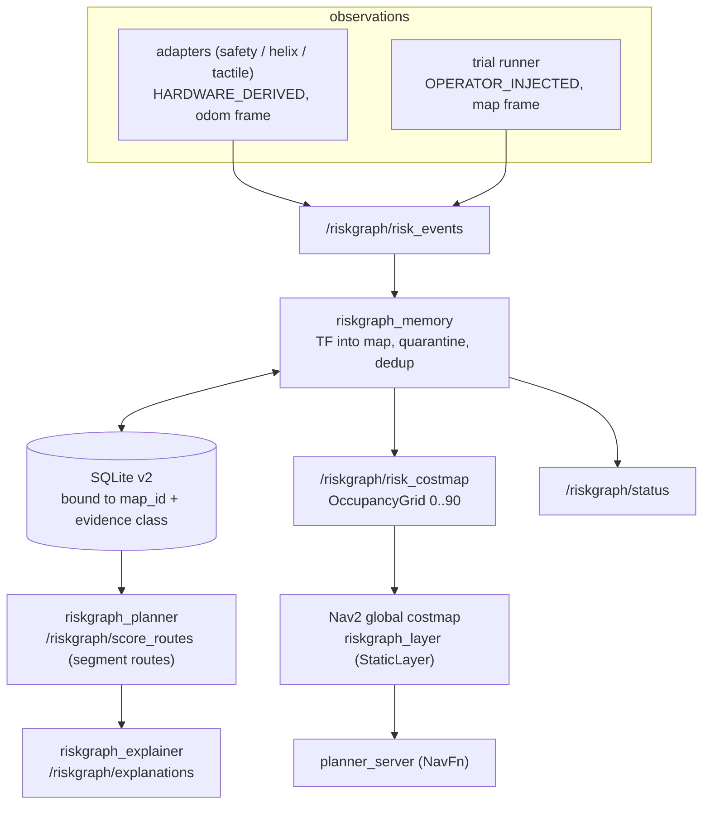

# Architecture

## Goals

1. Persist a typed, multi-modal record of risk events the robot has previously experienced, keyed to topological route segments, that survives across runs.
2. Use that record to score candidate routes, biasing the planner toward segments with lower historical risk while still respecting geometry and semantic objectives.
3. Emit deterministic, evidence-grounded explanations for the route choice, citing specific stored events.

These three goals must be met without coupling the core logic to ROS, so the same model is testable offline and reusable in non-ROS contexts (e.g. simulation harnesses).

## Overview

Two paths. The **risk-memory path** is RiskGraph proper; the **motion path**
runs Nav2 into one exit, `riskgraph_sport_sink` (Move / StopMove only, with a
deadman); the risk-memory nodes never publish into it (see `docs/HW_VERIFICATION.md` section 1 for the full live topology).



## Component responsibilities

### `riskgraph_msgs`: interfaces

Custom IDL for risk events, route segments, route scores, and explanations.
Built with `ament_cmake` and `rosidl_generate_interfaces`. No code logic.
The interface set is intentionally narrow; richer schemas (CLIP embeddings,
3D bounding boxes, etc.) belong in upstream packages and are referenced via
loose-typed `RiskFactor.detail` strings rather than baked into `riskgraph_msgs`.

### `riskgraph_core`: pure-Python model

Five modules:
- `events.py`: `RiskFactor`, `RiskEvent`, `FactorCategory`. Severity is clamped to [0,1]; unknown categories fall back to `OTHER`. `RiskEvent.aggregate_severity()` deliberately uses max-factor not sum, on the assumption that factors describe the same incident from different sensing modalities.
- `segments.py`: `RouteSegment`, `Route`, `segment_for_point` (nearest-segment spatial join, used by the memory node when an incoming event has no pre-assigned segment).
- `store.py`: `RiskStore` (SQLite-backed, schema in two tables: `risk_event` and `risk_factor`). Query path is segment-keyed and applies optional exponential decay at read time, so writes stay cheap. `:memory:` is supported for tests.
- `scoring.py`: `score_routes(candidates, store, weights, semantic_objective)`. Returns `RouteScoreResult` with per-route breakdown of geometry / semantic / risk costs and dominant segment + factor categories. Lower `total_cost` wins.
- `explainer.py`: `explain_choice(result, candidates, store)` produces a deterministic template-rendered explanation with `evidence_event_ids` cited verbatim. No LLM in the MVP path.
- `config.py`: YAML loader (`Config`, `load_config`). Defaults are sensible so a partial config still produces a working scorer.

The core has zero ROS imports and zero hardware imports. It runs under bare `python3` with `pyyaml` as the only third-party dependency.

### `riskgraph_memory`: ROS persistence node + adapters

`memory_node.py` is single-responsibility: it owns the durable log. It does not score, it does not explain. It exposes `QuerySegmentRisk.srv` as a debug/inspection hook.

Adapters are split per upstream source (`safety_adapter`, `helix_adapter`, `tactile_adapter`). Each is a separate console_script entry point so they can be started independently, gated by launch args. Each does a `try: import upstream_msgs; HAVE_X = True / except ImportError: HAVE_X = False` and exits cleanly if the upstream package is not installed, so missing upstream packages do not block the rest of the bringup.

`conversions.py` is pure-Python and is unit-tested with `SimpleNamespace` mocks, so the message-translation logic does not require the full ROS env.

### `riskgraph_planner`: scoring service

Thin ROS wrapper around `riskgraph_core.scoring.score_routes` and `riskgraph_core.explainer.explain_choice`. Reads weights and store path from parameters. The same SQLite file referenced by the memory node is opened for reads, so scoring sees live data.

### `riskgraph_explainer`: streaming explainer

Subscribes to `/riskgraph/route_scores` and publishes `/riskgraph/explanations`. This is for downstream consumers (UI overlays, voice synthesis) that prefer a topic over a service call. The planner already includes an explanation in the service response, so this node is **optional** for systems that only consume the service.

### `riskgraph_demo`: synthetic data + offline orchestrator

Two entry points:
- `riskgraph_synthetic_publisher`: replays a JSON scenario fixture as ROS RiskEvent messages onto `/riskgraph/risk_events`.
- `offline_demo`: pure-Python end-to-end exerciser that runs the full risk model against a fixture without spinning ROS, used in unit tests as a regression and in CI as a smoke test.

### `riskgraph_nav`: live integration

Anchored-odometry localization (`riskgraph_localization`), the live preflight,
the trial runner and its evidence report, the status CLI, replay parity, and a
rehearsal robot for off-robot runs. Publishes no robot command.

### `riskgraph_bringup`: launch + configs

- `riskgraph_live.launch.py`: memory + planner + explainer (+ optional adapters). Computes the map id and the single absolute database path from the experiment file.
- `riskgraph_nav_live.launch.py`: localization + map_server + planner/controller servers + velocity_smoother + lifecycle manager (`config/nav2_live.yaml`).
- `demo_offline.launch.py`: memory + planner + explainer + synthetic publisher, test-class database, no upstream dependencies.

`config/default.yaml` holds parameters in the standard ROS 2 `<node_name>: ros__parameters: ...` format.

## Persistence model

Schema v2 (`PRAGMA user_version = 2`; v1 files migrate in place on writable open):

```sql
meta(key PK, value)            -- map_id, evidence_class, created_at, migrated_from
risk_event(event_id PK, timestamp, position_xyz, frame_id, segment_id, confidence,
           provenance, source_frame_id, map_id, run_mode, ingest_time, clock_note)
risk_factor(event_id FK, category, severity, source, detail)
quarantine(id PK, event_id, reason, detail, ingest_time, raw_json)
```

Paths must be absolute. The first writer binds the file to a map id and an
evidence class (`live`, `rehearsal`, `replay`, `test`); a mismatch on a later
open raises instead of mixing data. Duplicate event ids are ignored (first
write wins). Stored positions are in `map`.

Decay is computed at *read* time by applying `exp(-ln(2)/half_life * (now - timestamp))` to each event's severity. This keeps the write path a single insert and means the same on-disk store works under any decay setting.

`segment_id` is nullable: the memory node will store an event without a segment id if no spatial-join target is configured. This avoids dropping events when segment metadata is incomplete; the planner ignores unbound events automatically because they don't match any candidate segment.

## Scoring model

```
total_cost(route) = w_geom · length(route)
                  + w_sem  · semantic_penalty(route, objective)
                  + w_risk · Σ_seg cumulative_risk(seg, decay)
```

Where:
- `length(route)` is sum of segment Euclidean lengths.
- `semantic_penalty(route, objective)` is 0 if any segment label contains the objective string, 1 otherwise. (MVP: substring match. Future: CLIP-embedding match against upstream `SemanticDetection.embedding`.)
- `cumulative_risk(seg, decay)` is `Σ_event aggregate_severity(event) · exp(-λ · age)` over events linked to that segment.

Defaults (`config/default.yaml`): `w_geom=1.0, w_sem=1.0, w_risk=4.0, half_life=1800s`.
With `w_risk=4.0` the planner is willing to take a substantially longer route to avoid a single severe segment; this is the right bias for an assistive guide-dog setting where slipping in front of a low-vision user has higher cost than walking 30 % further. The weights are exposed as ROS parameters so they can be tuned without rebuilding.

## Explanation model

`explain_choice` walks four cases in order:

1. **Avoid risky alternative**: an unchosen route had material risk on a segment the chosen route avoids; cite the dominant factor category and up to 3 backing event ids.
2. **Semantic match**: semantic objective matched by chosen route only.
3. **Geometry only**: no risk anywhere; chosen is shorter.
4. **Fallback**: generic combined-cost message.

Templates are deterministic. There is no online LLM call. Future work can plug an LLM in front of this output to rephrase, but the **evidence_event_ids** field is the audit hook: any rephrasing must still carry those ids forward, so a reviewer can verify the claim against the persistent log.

## Spatial risk model (what Nav2 sees)

`riskgraph_core.risk_field`: every stored map-frame event adds
`w * (1 - (d/r)^2)` within radius `r` (0.8 m), `w = aggregate severity x decay`.
Cells are `min(90, round(90 * risk))`. Compact support means an event cannot
affect a route more than `r` away; the cap below 100 means risk is never an
obstacle. Decay is off for the trial (the half life is a parameter).

## Hardware proof boundary

Hardware experiment prepared, physical behavior unverified. Unit tests, ROS
integration tests against real Nav2 processes and a full rehearsal of the
live procedure run off-robot. The live procedure is `docs/HW_VERIFICATION.md`.

## What's intentionally absent

- **Online LLM in the explanation path.** Determinism + auditable evidence first. LLM rephrasing is a v0.2 concern.
- **Custom CUDA / Gaussian splatting / heavyweight perception.** Out of scope; we consume upstream perception as messages.
- **Path planning from scratch or a custom Nav2 plugin.** Nav2's NavFn plans; RiskGraph only contributes a cost layer through a stock StaticLayer.
- **Motion outside one exit.** Only `riskgraph_sport_sink` publishes sport requests (Move 1008 / StopMove 1003); nothing publishes `/cmd_vel`.
- **Mutable graph topology in the MVP.** Segments are static within a session. Cross-run topology learning is a v0.3 concern.
